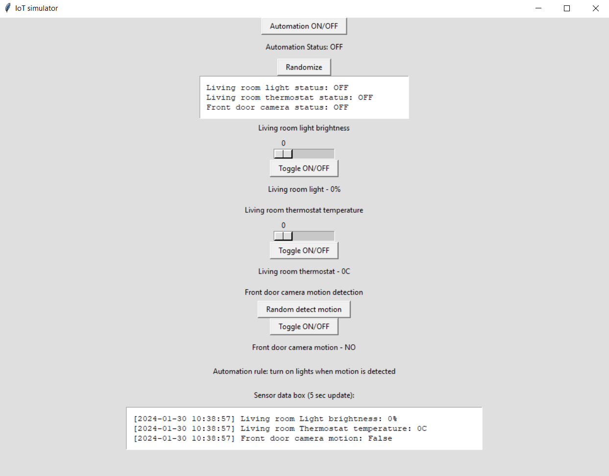

# IoT simulator
It is a Python-based IoT simulator for a smart home automation system. 
The simulator emulates the behavior of various IoT devices commonly found in a smart home.
Some of these devices are smart lights, thermostats, and security cameras. 
There is also a central automation system that manages these devices. 
The monitoring dashboard GUI will help to visualize and control the smart home.

### You can find the documentation in the "IoT_sim_documentation.pdf" file.

## Instructions
### How to run the simulation (Windows)
One of the ways to run the simulation after downloading IoT simulator
1. Open the folder in the console.
* To do this you can copy the path of the folder in Windows Explorer, open console and type “cd <path you copied>”.
2. Type “python main.py” to run the GUI
* It is possible only if Python is installed on your computer

### How to use the dashboard
GUI allows monitoring of the smart home system through several text fields which are implemented on the dashboard. For example, to see the current status (“ON” or “OFF”) of all the devices it is enough to check the text box which goes right after the “randomize” button on the top. To check the current state of core feature of each device, for instance brightness of the light, it is enough to look at the text right after the button “Toggle ON/OFF”.
For controlling the smart home system there are located different buttons and scales. For example, to turn on the automation you can tap on the first button on the top of the page called “Automation ON/OFF”. To adjust different things to devices and change their statuses you can interact with buttons and scales which were created for each device. Hence, to change the brightness of the light you can pull the scale which is under the text “Living room light brightness”.